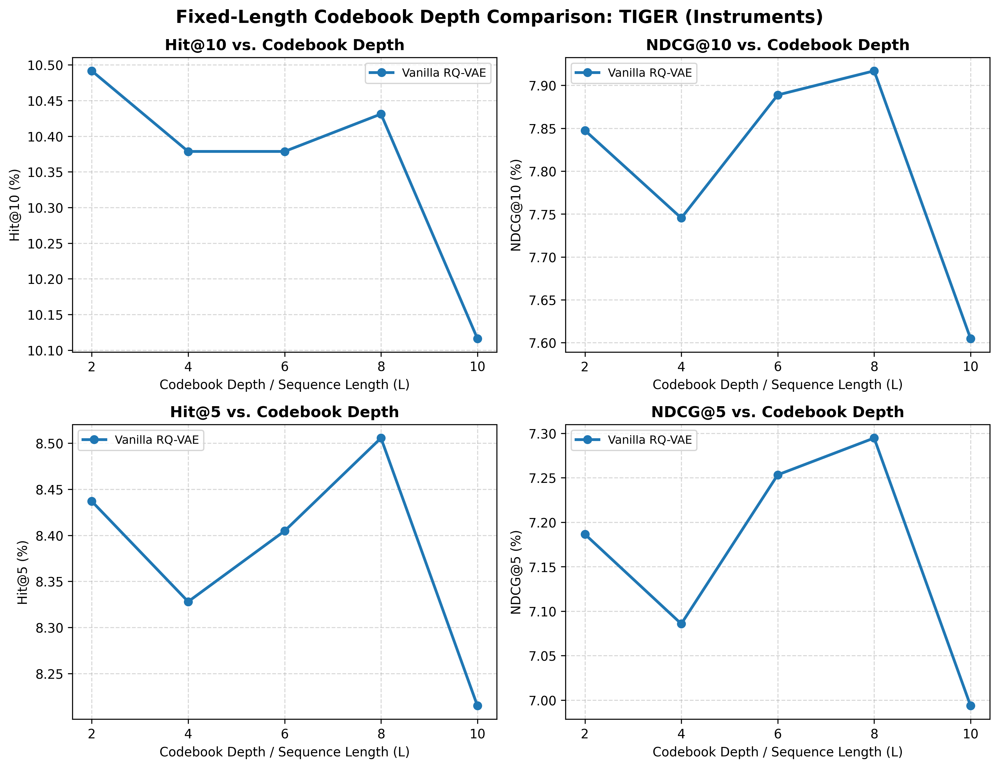

# Fixed-Length Codebook Depth Comparison: TIGER (Instruments)

- **Dataset**: `Instruments`
- **Model**: `TIGER`
- **Tokenizers Evaluated**: `Vanilla RQ-VAE`
- **Evaluated Depths (L)**: 2, 4, 6, 8, 10

### Performance Curves

### 1. Recommendation Performance Across Codebook Depths

| Tokenizer | Length (L) | Hit@1 | Hit@5 | Hit@10 | NDCG@5 | NDCG@10 | Status |
| :--- | :---: | :---: | :---: | :---: | :---: | :---: | :---: |
| **Vanilla RQ-VAE** | 2 | 5.93% | 8.44% | 10.49% | 7.19% | 7.85% | completed |
| **Vanilla RQ-VAE** | 4 | 5.85% | 8.33% | 10.38% | 7.09% | 7.75% | completed |
| **Vanilla RQ-VAE** | 6 | 6.06% | 8.40% | 10.38% | 7.25% | 7.89% | completed |
| **Vanilla RQ-VAE** | 8 | 6.08% | 8.51% | 10.43% | 7.29% | 7.92% | completed |
| **Vanilla RQ-VAE** | 10 | 5.78% | 8.21% | 10.12% | 6.99% | 7.60% | completed |

