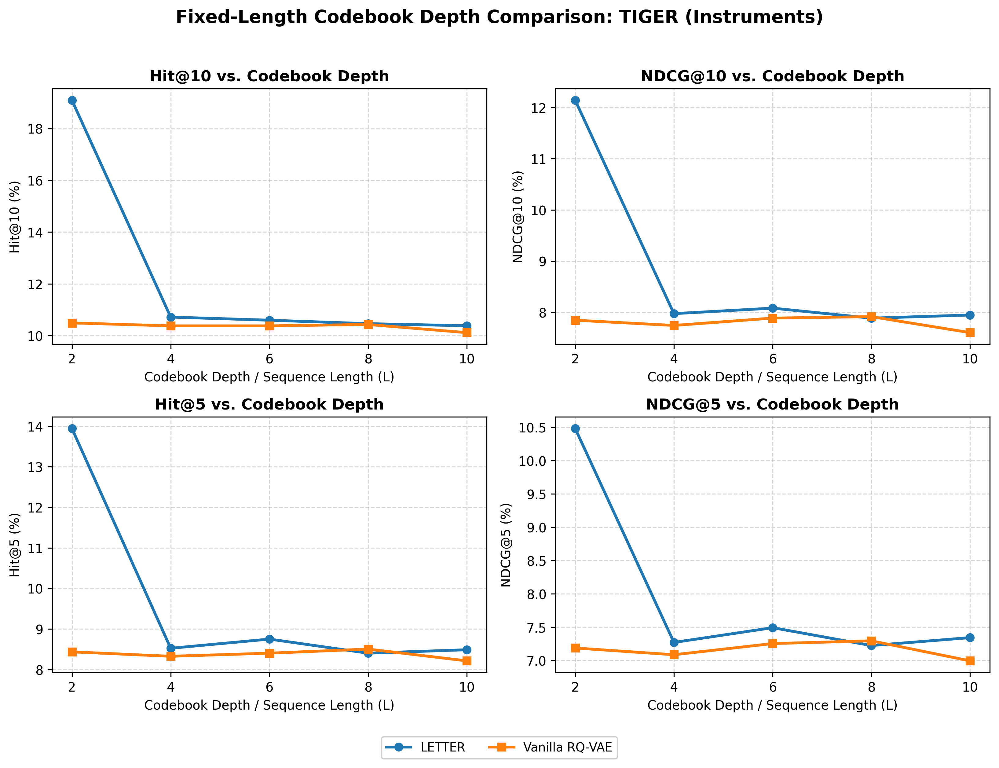

# Fixed-Length Codebook Depth Comparison: TIGER (Instruments)

- **Dataset**: `Instruments`
- **Model**: `TIGER`
- **Tokenizers Evaluated**: `LETTER`, `Vanilla RQ-VAE`
- **Evaluated Depths (L)**: 2, 4, 6, 8, 10

### Performance Curves

### 1. Recommendation Performance Across Codebook Depths

| Tokenizer | Length (L) | Hit@1 | Hit@5 | Hit@10 | NDCG@5 | NDCG@10 | Status |
| :--- | :---: | :---: | :---: | :---: | :---: | :---: | :---: |
| **LETTER** | 2 | 6.90% | 13.94% | 19.09% | 10.48% | 12.14% | completed |
| **Vanilla RQ-VAE** | 2 | 5.93% | 8.44% | 10.49% | 7.19% | 7.85% | completed |
| **LETTER** | 4 | 5.96% | 8.53% | 10.72% | 7.27% | 7.98% | completed |
| **Vanilla RQ-VAE** | 4 | 5.85% | 8.33% | 10.38% | 7.09% | 7.75% | completed |
| **LETTER** | 6 | 6.24% | 8.75% | 10.60% | 7.49% | 8.08% | completed |
| **Vanilla RQ-VAE** | 6 | 6.06% | 8.40% | 10.38% | 7.25% | 7.89% | completed |
| **LETTER** | 8 | 5.99% | 8.40% | 10.46% | 7.22% | 7.89% | completed |
| **Vanilla RQ-VAE** | 8 | 6.08% | 8.51% | 10.43% | 7.29% | 7.92% | completed |
| **LETTER** | 10 | 6.18% | 8.49% | 10.38% | 7.34% | 7.95% | completed |
| **Vanilla RQ-VAE** | 10 | 5.78% | 8.21% | 10.12% | 6.99% | 7.60% | completed |

### 2. Hit@10 (%) Comparison Across Tokenizers

| Length (L) | LETTER | Vanilla RQ-VAE | Best |
| :---: | :---: | :---: | :---: |
| 2 | 19.09% | 10.49% | **LETTER** |
| 4 | 10.72% | 10.38% | **LETTER** |
| 6 | 10.60% | 10.38% | **LETTER** |
| 8 | 10.46% | 10.43% | **LETTER** |
| 10 | 10.38% | 10.12% | **LETTER** |

### 3. NDCG@10 (%) Comparison Across Tokenizers

| Length (L) | LETTER | Vanilla RQ-VAE | Best |
| :---: | :---: | :---: | :---: |
| 2 | 12.14% | 7.85% | **LETTER** |
| 4 | 7.98% | 7.75% | **LETTER** |
| 6 | 8.08% | 7.89% | **LETTER** |
| 8 | 7.89% | 7.92% | **Vanilla RQ-VAE** |
| 10 | 7.95% | 7.60% | **LETTER** |

