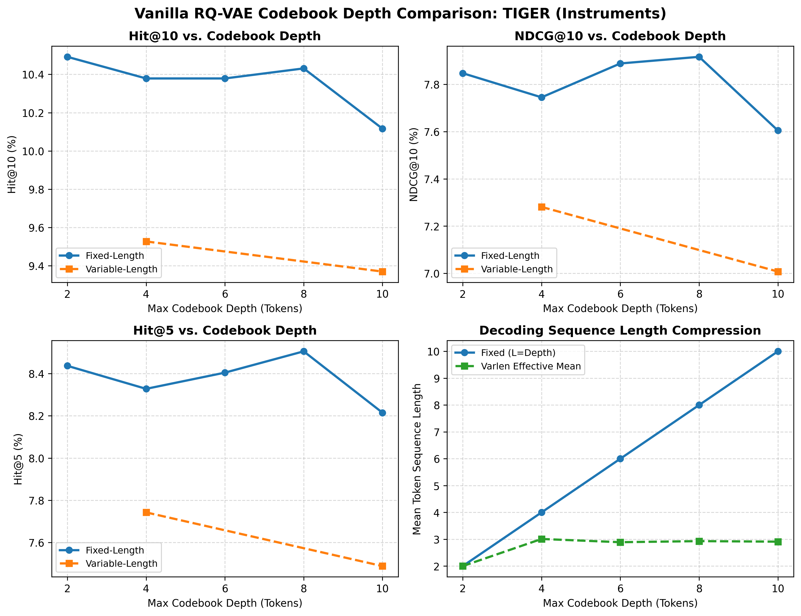

# Vanilla RQ-VAE Codebook Length Experiment Summary: TIGER (Instruments)

- **Dataset**: `Instruments`
- **Model**: `TIGER`
- **Tokenizer**: `rqvae`
- **Evaluated Depths**: 2, 4, 6, 8, 10

### Performance Curves

### 1. Recommendation Performance by Codebook Depth

| Model | Mode | Max L | Mean L | Hit@1 | Hit@5 | Hit@10 | NDCG@5 | NDCG@10 | Status |
| :--- | :--- | :---: | :---: | :---: | :---: | :---: | :---: | :---: | :---: |
| **TIGER** | fixed | 2 | 2.00 | 5.93% | 8.44% | 10.49% | 7.19% | 7.85% | completed |
| **TIGER** | varlen | 2 | 2.00 | - | - | - | - | - | pending |
| **TIGER** | fixed | 4 | 4.00 | 5.85% | 8.33% | 10.38% | 7.09% | 7.75% | completed |
| **TIGER** | varlen | 4 | 3.01 | 5.66% | 7.74% | 9.53% | 6.71% | 7.28% | completed |
| **TIGER** | fixed | 6 | 6.00 | 6.06% | 8.40% | 10.38% | 7.25% | 7.89% | completed |
| **TIGER** | varlen | 6 | 2.89 | - | - | - | - | - | pending |
| **TIGER** | fixed | 8 | 8.00 | 6.08% | 8.51% | 10.43% | 7.29% | 7.92% | completed |
| **TIGER** | varlen | 8 | 2.93 | - | - | - | - | - | pending |
| **TIGER** | fixed | 10 | 10.00 | 5.78% | 8.21% | 10.12% | 6.99% | 7.60% | completed |
| **TIGER** | varlen | 10 | 2.91 | 5.34% | 7.49% | 9.37% | 6.40% | 7.01% | completed |
