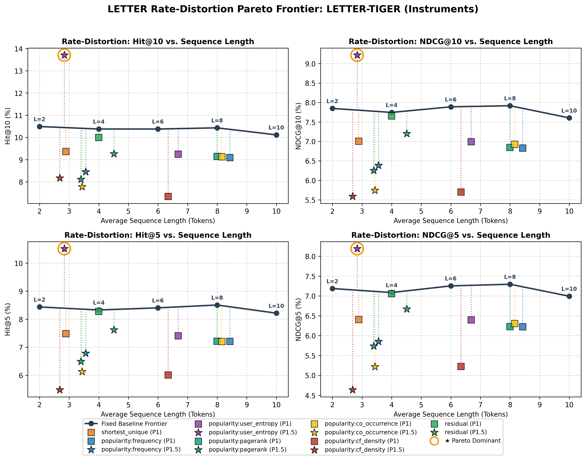
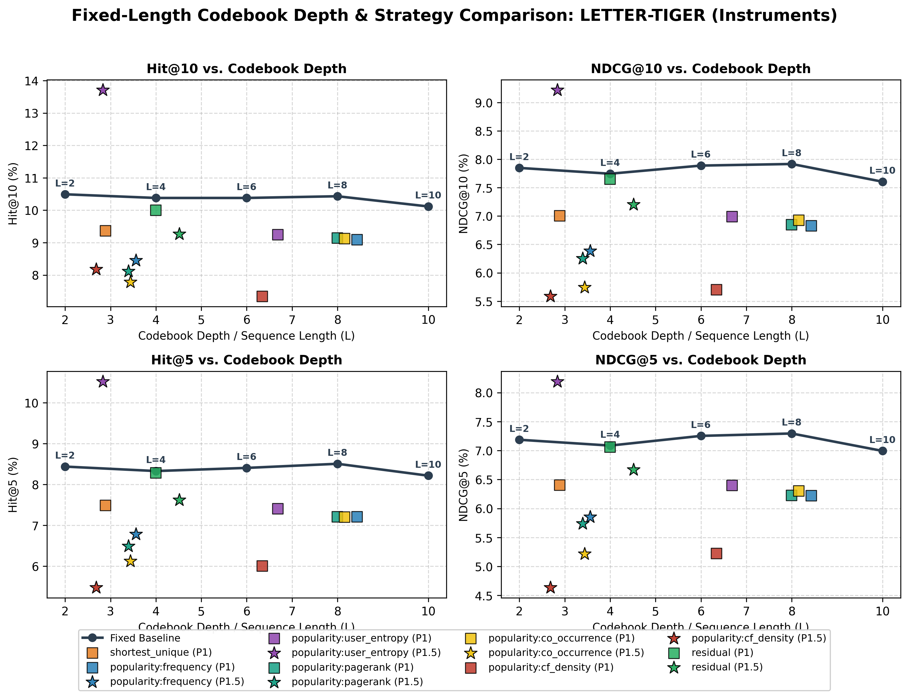

# Vanilla RQ-VAE Strategy Comparison Report: LETTER-TIGER (Instruments)

- **Dataset**: `Instruments`
- **Model**: `LETTER-TIGER`
- **Tokenizer**: `rqvae`
- **Training Phase**: `Phase 1 & Phase 1.5 (All)`
- **Catalog Items**: 9,922
- **Total Interactions**: 206,153
- **Fixed ID Depth**: 10 tokens
- **Minimum Allowable Depth**: 1 token

### 1. Recommendation Performance

| Strategy | Phase | Mean Length | Weighted Length | Collisions | Hit@1 | Hit@5 | Hit@10 | NDCG@5 | NDCG@10 | Status |
| :--- | :---: | :---: | :---: | :---: | :---: | :---: | :---: | :---: | :---: | :---: |
| **fixed_L2** | - | 2.00 | 2.00 | 1195 | 5.93% | 8.44% | 10.49% | 7.19% | 7.85% | completed |
| **fixed_L4** | - | 4.00 | 4.00 | 388 | 5.85% | 8.33% | 10.38% | 7.09% | 7.75% | completed |
| **fixed_L6** | - | 6.00 | 6.00 | 25 | 6.06% | 8.40% | 10.38% | 7.25% | 7.89% | completed |
| **fixed_L8** | - | 8.00 | 8.00 | 25 | 6.08% | 8.51% | 10.43% | 7.29% | 7.92% | completed |
| **fixed** | - | 10.00 | 10.00 | 25 | 5.78% | 8.21% | 10.12% | 6.99% | 7.60% | completed |
| **shortest_unique** | 1 | 2.89 | 3.06 | 25 | 5.34% | 7.49% | 9.37% | 6.40% | 7.01% | completed |
| **popularity:frequency** | 1 | 8.43 | 6.05 | 25 | 5.23% | 7.21% | 9.09% | 6.22% | 6.83% | completed |
| **popularity:frequency** | 1.5 | 3.56 | 5.50 | 200 | 4.87% | 6.79% | 8.45% | 5.85% | 6.38% | completed |
| **popularity:user_entropy** | 1 | 6.68 | 4.48 | 25 | 5.39% | 7.41% | 9.25% | 6.40% | 6.99% | completed |
| **popularity:user_entropy** | 1.5 | 2.83 | 3.35 | 1412 | 5.76% | 10.52% | 13.70% | 8.19% | 9.22% | completed |
| **popularity:pagerank** | 1 | 7.99 | 5.64 | 25 | 5.23% | 7.21% | 9.14% | 6.23% | 6.85% | completed |
| **popularity:pagerank** | 1.5 | 3.39 | 4.99 | 275 | 5.00% | 6.49% | 8.11% | 5.74% | 6.25% | completed |
| **popularity:co_occurrence** | 1 | 8.16 | 5.72 | 25 | 5.41% | 7.21% | 9.13% | 6.31% | 6.93% | completed |
| **popularity:co_occurrence** | 1.5 | 3.44 | 5.01 | 348 | 4.24% | 6.13% | 7.78% | 5.22% | 5.74% | completed |
| **popularity:cf_density** | 1 | 6.34 | 5.88 | 25 | 4.43% | 6.01% | 7.35% | 5.23% | 5.70% | completed |
| **popularity:cf_density** | 1.5 | 2.68 | 5.36 | 1899 | 3.81% | 5.48% | 8.17% | 4.63% | 5.59% | completed |
| **residual** | 1 | 4.00 | 9.34 | 25 | 5.83% | 8.28% | 10.00% | 7.06% | 7.65% | completed |
| **residual** | 1.5 | 4.51 | 4.48 | 228 | 5.67% | 7.62% | 9.26% | 6.67% | 7.20% | completed |

### 2. Semantic ID Evaluation & Compression

| Strategy | Phase | Catalog Mean | Traffic W-Len | Token Savings | L=1 | L=2 | L=3 | L=4 | L=5 | L=6 | L=7 | L=8 | L=9 | L=10 | Collisions | Spearman ρ |
| :--- | :---: | :---: | :---: | :---: | :---: | :---: | :---: | :---: | :---: | :---: | :---: | :---: | :---: | :---: | :---: | :---: |
| **fixed_L2** | - | 2.000 | 2.000 | 80.0% | 0.0% | 100.0% | 0.0% | 0.0% | 0.0% | 0.0% | 0.0% | 0.0% | 0.0% | 0.0% | 1195 | - |
| **fixed_L4** | - | 4.000 | 4.000 | 60.0% | 0.0% | 0.0% | 0.0% | 100.0% | 0.0% | 0.0% | 0.0% | 0.0% | 0.0% | 0.0% | 388 | - |
| **fixed_L6** | - | 6.000 | 6.000 | 40.0% | 0.0% | 0.0% | 0.0% | 0.0% | 0.0% | 100.0% | 0.0% | 0.0% | 0.0% | 0.0% | 25 | - |
| **fixed_L8** | - | 8.000 | 8.000 | 20.0% | 0.0% | 0.0% | 0.0% | 0.0% | 0.0% | 0.0% | 0.0% | 100.0% | 0.0% | 0.0% | 25 | - |
| **fixed** | - | 10.000 | 10.000 | 0.0% | 0.0% | 0.0% | 0.0% | 0.0% | 0.0% | 0.0% | 0.0% | 0.0% | 0.0% | 100.0% | 25 | - |
| **shortest_unique** | 1 | 2.888 | 3.056 | 69.4% | 0.0% | 51.7% | 36.4% | 4.9% | 1.8% | 1.0% | 0.2% | 0.0% | 0.0% | 4.0% | 25 | - |
| **popularity:frequency** | 1 | 8.428 | 6.055 | 39.5% | 0.0% | 0.5% | 1.7% | 2.7% | 4.1% | 6.4% | 9.5% | 14.3% | 22.0% | 38.8% | 25 | 1.0000 |
| **popularity:frequency** | 1.5 | 3.558 | 5.497 | 45.0% | 1.7% | 8.1% | 23.1% | 67.2% | 0.0% | 0.0% | 0.0% | 0.0% | 0.0% | 0.0% | 200 | -0.9279 |
| **popularity:user_entropy** | 1 | 6.682 | 4.484 | 55.2% | 0.0% | 5.6% | 11.0% | 8.7% | 9.4% | 10.2% | 11.0% | 12.0% | 13.3% | 18.8% | 25 | 1.0000 |
| **popularity:user_entropy** | 1.5 | 2.834 | 3.352 | 66.5% | 15.3% | 21.5% | 27.6% | 35.6% | 0.0% | 0.0% | 0.0% | 0.0% | 0.0% | 0.0% | 1412 | -0.9827 |
| **popularity:pagerank** | 1 | 7.994 | 5.637 | 43.6% | 0.0% | 0.8% | 2.9% | 3.9% | 6.1% | 8.6% | 11.6% | 15.5% | 19.9% | 30.8% | 25 | 0.9319 |
| **popularity:pagerank** | 1.5 | 3.395 | 4.987 | 50.1% | 2.9% | 11.8% | 28.4% | 57.0% | 0.0% | 0.0% | 0.0% | 0.0% | 0.0% | 0.0% | 275 | -0.9660 |
| **popularity:co_occurrence** | 1 | 8.155 | 5.718 | 42.8% | 0.0% | 1.5% | 3.4% | 3.8% | 5.3% | 6.9% | 9.2% | 12.8% | 18.8% | 38.3% | 25 | 0.8315 |
| **popularity:co_occurrence** | 1.5 | 3.436 | 5.009 | 49.9% | 4.0% | 10.8% | 22.8% | 62.4% | 0.0% | 0.0% | 0.0% | 0.0% | 0.0% | 0.0% | 348 | -0.9552 |
| **popularity:cf_density** | 1 | 6.339 | 5.879 | 41.2% | 0.0% | 7.9% | 13.8% | 9.7% | 9.6% | 9.7% | 9.9% | 10.2% | 11.0% | 18.2% | 25 | 0.4135 |
| **popularity:cf_density** | 1.5 | 2.681 | 5.362 | 46.4% | 20.4% | 22.8% | 25.1% | 31.7% | 0.0% | 0.0% | 0.0% | 0.0% | 0.0% | 0.0% | 1899 | -0.9890 |
| **residual** | 1 | 3.996 | 9.343 | 6.6% | 0.0% | 0.0% | 0.4% | 99.6% | 0.0% | 0.0% | 0.0% | 0.0% | 0.0% | 0.0% | 25 | - |
| **residual** | 1.5 | 4.513 | 4.482 | 55.2% | 0.2% | 2.6% | 17.3% | 33.9% | 26.9% | 13.0% | 4.2% | 1.4% | 0.4% | 0.1% | 228 | - |

### 3. Rate-Distortion & Pareto Frontier Analysis

> Benchmarking variable-length token efficiency against fixed-length baselines of equivalent token budgets.
> - **Floor Baseline ($L_{\text{floor}}$)**: Highest evaluated fixed depth $\le$ Mean Length.
> - **Ceiling Baseline ($L_{\text{ceil}}$)**: Lowest evaluated fixed depth $\ge$ Mean Length.
> - **Interpolated ($L_{\text{interp}}$)**: Expected fixed metric at matched average token length: $M_{\text{interp}} = (1-\alpha) M_{\text{floor}} + \alpha M_{\text{ceil}}$.
> - **Pareto Classification**:
>   - **★ Dominant**: Variable model achieves equal or higher recommendation quality using strictly fewer tokens than $L_{\text{ceil}}$ ($M \ge M_{\text{ceil}}$ with $\bar{L} \le L_{\text{ceil}}$).
>   - **▲ Efficient**: Variable model outperforms the interpolated fixed baseline at matched token budget ($\Delta_{\text{interp}} > 0$).
>   - **≈ Parity**: Within 2% of matched-budget baseline.
>   - **▼ Trade-off**: Standard compression trade-off.

#### Codebook Depth & Strategy Comparison

#### Reference Fixed-Length Rate-Distortion Curve

| Depth (L) | Mean Length | Hit@1 | Hit@5 | Hit@10 | NDCG@5 | NDCG@10 | Token Savings |
| :---: | :---: | :---: | :---: | :---: | :---: | :---: | :---: |
| **L=2** | 2.00 | 5.93% | 8.44% | 10.49% | 7.19% | 7.85% | 80.0% |
| **L=4** | 4.00 | 5.85% | 8.33% | 10.38% | 7.09% | 7.75% | 60.0% |
| **L=6** | 6.00 | 6.06% | 8.40% | 10.38% | 7.25% | 7.89% | 40.0% |
| **L=8** | 8.00 | 6.08% | 8.51% | 10.43% | 7.29% | 7.92% | 20.0% |
| **L=10** | 10.00 | 5.78% | 8.21% | 10.12% | 6.99% | 7.60% | 0.0% |

#### Variable-Length Rate-Distortion Frontier & Pareto Evaluation

| Strategy | Phase | Mean Length | Token Savings | Hit@10 | NDCG@10 | Floor L | Ceil L | Interp NDCG@10 | Δ vs Interp | Δ vs L_max | Pareto Status |
| :--- | :---: | :---: | :---: | :---: | :---: | :---: | :---: | :---: | :---: | :---: | :---: |
| **shortest_unique** | 1 | 2.89 | 69.4% | 9.37% | 7.01% | L=2 | L=4 | 7.80% | **-10.2%** | -7.9% | ▼ Trade-off |
| **popularity:frequency** | 1 | 8.43 | 39.5% | 9.09% | 6.83% | L=8 | L=10 | 7.85% | **-13.0%** | -10.2% | ▼ Trade-off |
| **popularity:frequency** | 1.5 | 3.56 | 45.0% | 8.45% | 6.38% | L=2 | L=4 | 7.77% | **-17.8%** | -16.0% | ▼ Trade-off |
| **popularity:user_entropy** | 1 | 6.68 | 55.2% | 9.25% | 6.99% | L=6 | L=8 | 7.90% | **-11.5%** | -8.0% | ▼ Trade-off |
| **popularity:user_entropy** | 1.5 | 2.83 | 66.5% | 13.70% | 9.22% | L=2 | L=4 | 7.80% | **+18.1%** | +21.2% | ★ Dominant |
| **popularity:pagerank** | 1 | 7.99 | 43.6% | 9.14% | 6.85% | L=6 | L=8 | 7.92% | **-13.5%** | -10.0% | ▼ Trade-off |
| **popularity:pagerank** | 1.5 | 3.39 | 50.1% | 8.11% | 6.25% | L=2 | L=4 | 7.78% | **-19.6%** | -17.8% | ▼ Trade-off |
| **popularity:co_occurrence** | 1 | 8.16 | 42.8% | 9.13% | 6.93% | L=8 | L=10 | 7.89% | **-12.3%** | -8.9% | ▼ Trade-off |
| **popularity:co_occurrence** | 1.5 | 3.44 | 49.9% | 7.78% | 5.74% | L=2 | L=4 | 7.77% | **-26.1%** | -24.5% | ▼ Trade-off |
| **popularity:cf_density** | 1 | 6.34 | 41.2% | 7.35% | 5.70% | L=6 | L=8 | 7.89% | **-27.8%** | -25.0% | ▼ Trade-off |
| **popularity:cf_density** | 1.5 | 2.68 | 46.4% | 8.17% | 5.59% | L=2 | L=4 | 7.81% | **-28.5%** | -26.5% | ▼ Trade-off |
| **residual** | 1 | 4.00 | 6.6% | 10.00% | 7.65% | L=2 | L=4 | 7.75% | **-1.2%** | +0.7% | ≈ Parity |
| **residual** | 1.5 | 4.51 | 55.2% | 9.26% | 7.20% | L=4 | L=6 | 7.78% | **-7.5%** | -5.3% | ▼ Trade-off |

### 4. Phase 1 vs. Phase 1.5 Head-to-Head Comparison

> Direct comparison of Post-Hoc Truncation (Phase 1) vs. Length-Aware Training (Phase 1.5). Positive Δ indicates improvement from length-aware training. SID Agreement and Mean |ΔL| indicate whether semantic IDs changed or remained identical across phases.

| Strategy | P1 Mean Length | P1.5 Mean Length | Mean \|ΔL\| | SID Agreement | P1 Hit@10 | P1.5 Hit@10 | Δ Hit@10 | P1 NDCG@10 | P1.5 NDCG@10 | Δ NDCG@10 |
| :--- | :---: | :---: | :---: | :---: | :---: | :---: | :---: | :---: | :---: | :---: |
| **popularity:frequency** | 8.43 | 3.56 | 0.090 | 0.00% | 9.09% | 8.45% | **-0.64%** | 6.83% | 6.38% | **-0.45%** |
| **popularity:user_entropy** | 6.68 | 2.83 | 0.295 | 0.00% | 9.25% | 13.70% | **+4.45%** | 6.99% | 9.22% | **+2.22%** |
| **popularity:pagerank** | 7.99 | 3.39 | 0.120 | 0.00% | 9.14% | 8.11% | **-1.03%** | 6.85% | 6.25% | **-0.59%** |
| **popularity:co_occurrence** | 8.16 | 3.44 | 0.115 | 0.00% | 9.13% | 7.78% | **-1.35%** | 6.93% | 5.74% | **-1.18%** |
| **popularity:cf_density** | 6.34 | 2.68 | 0.343 | 0.00% | 7.35% | 8.17% | **+0.83%** | 5.70% | 5.59% | **-0.11%** |
| **residual** | 4.00 | 4.51 | 4.846 | 0.00% | 10.00% | 9.26% | **-0.73%** | 7.65% | 7.20% | **-0.45%** |

### 5. Pairwise Exact Semantic ID Agreement Rate (%)

> Percentage of items in catalog that receive an identical Semantic ID across strategies.

| Strategy | fixed_L2 | fixed_L4 | fixed_L6 | fixed_L8 | fixed | shortest_unique (P1) | popularity:frequency (P1) | popularity:frequency (P1.5) | popularity:user_entropy (P1) | popularity:user_entropy (P1.5) | popularity:pagerank (P1) | popularity:pagerank (P1.5) | popularity:co_occurrence (P1) | popularity:co_occurrence (P1.5) | popularity:cf_density (P1) | popularity:cf_density (P1.5) | residual (P1) | residual (P1.5) |
| :--- | :---: | :---: | :---: | :---: | :---: | :---: | :---: | :---: | :---: | :---: | :---: | :---: | :---: | :---: | :---: | :---: | :---: | :---: |
| **fixed_L2** | 100.00% | 0.00% | 0.00% | 0.00% | 0.00% | 0.00% | 0.00% | 0.00% | 0.00% | 0.00% | 0.00% | 0.00% | 0.00% | 0.00% | 0.00% | 0.00% | 0.00% | 0.00% |
| **fixed_L4** | 0.00% | 100.00% | 0.00% | 0.00% | 0.00% | 4.95% | 2.70% | 0.00% | 8.68% | 0.00% | 3.89% | 0.00% | 3.81% | 0.00% | 9.73% | 0.00% | 0.00% | 0.00% |
| **fixed_L6** | 0.00% | 0.00% | 100.00% | 0.00% | 0.00% | 0.00% | 0.00% | 0.00% | 0.00% | 0.00% | 0.00% | 0.00% | 0.00% | 0.00% | 0.00% | 0.00% | 0.00% | 0.00% |
| **fixed_L8** | 0.00% | 0.00% | 0.00% | 100.00% | 0.00% | 0.00% | 0.00% | 0.00% | 0.00% | 0.00% | 0.00% | 0.00% | 0.00% | 0.00% | 0.00% | 0.00% | 0.00% | 0.00% |
| **fixed** | 0.00% | 0.00% | 0.00% | 0.00% | 100.00% | 4.03% | 38.83% | 0.00% | 18.84% | 0.00% | 30.76% | 0.00% | 38.31% | 0.00% | 18.18% | 0.00% | 0.00% | 0.00% |
| **shortest_unique (P1)** | 0.00% | 4.95% | 0.00% | 0.00% | 4.03% | 100.00% | 6.14% | 0.00% | 19.86% | 0.00% | 7.40% | 0.00% | 8.45% | 0.00% | 24.50% | 0.00% | 0.00% | 0.00% |
| **popularity:frequency (P1)** | 0.00% | 2.70% | 0.00% | 0.00% | 38.83% | 6.14% | 100.00% | 0.00% | 20.94% | 0.00% | 52.24% | 0.00% | 53.43% | 0.00% | 16.97% | 0.00% | 0.00% | 0.00% |
| **popularity:frequency (P1.5)** | 0.00% | 0.00% | 0.00% | 0.00% | 0.00% | 0.00% | 0.00% | 100.00% | 0.00% | 0.01% | 0.00% | 0.00% | 0.00% | 0.00% | 0.00% | 0.00% | 0.00% | 0.00% |
| **popularity:user_entropy (P1)** | 0.00% | 8.68% | 0.00% | 0.00% | 18.84% | 19.86% | 20.94% | 0.00% | 100.00% | 0.00% | 26.83% | 0.00% | 24.99% | 0.00% | 23.93% | 0.00% | 0.00% | 0.00% |
| **popularity:user_entropy (P1.5)** | 0.00% | 0.00% | 0.00% | 0.00% | 0.00% | 0.00% | 0.00% | 0.01% | 0.00% | 100.00% | 0.00% | 0.00% | 0.00% | 0.00% | 0.00% | 0.00% | 0.00% | 0.00% |
| **popularity:pagerank (P1)** | 0.00% | 3.89% | 0.00% | 0.00% | 30.76% | 7.40% | 52.24% | 0.00% | 26.83% | 0.00% | 100.00% | 0.00% | 47.19% | 0.00% | 16.57% | 0.00% | 0.00% | 0.00% |
| **popularity:pagerank (P1.5)** | 0.00% | 0.00% | 0.00% | 0.00% | 0.00% | 0.00% | 0.00% | 0.00% | 0.00% | 0.00% | 0.00% | 100.00% | 0.00% | 0.01% | 0.00% | 0.00% | 0.00% | 0.00% |
| **popularity:co_occurrence (P1)** | 0.00% | 3.81% | 0.00% | 0.00% | 38.31% | 8.45% | 53.43% | 0.00% | 24.99% | 0.00% | 47.19% | 0.00% | 100.00% | 0.00% | 19.37% | 0.00% | 0.00% | 0.00% |
| **popularity:co_occurrence (P1.5)** | 0.00% | 0.00% | 0.00% | 0.00% | 0.00% | 0.00% | 0.00% | 0.00% | 0.00% | 0.00% | 0.00% | 0.01% | 0.00% | 100.00% | 0.00% | 0.00% | 0.00% | 0.00% |
| **popularity:cf_density (P1)** | 0.00% | 9.73% | 0.00% | 0.00% | 18.18% | 24.50% | 16.97% | 0.00% | 23.93% | 0.00% | 16.57% | 0.00% | 19.37% | 0.00% | 100.00% | 0.00% | 0.00% | 0.00% |
| **popularity:cf_density (P1.5)** | 0.00% | 0.00% | 0.00% | 0.00% | 0.00% | 0.00% | 0.00% | 0.00% | 0.00% | 0.00% | 0.00% | 0.00% | 0.00% | 0.00% | 0.00% | 100.00% | 0.00% | 0.00% |
| **residual (P1)** | 0.00% | 0.00% | 0.00% | 0.00% | 0.00% | 0.00% | 0.00% | 0.00% | 0.00% | 0.00% | 0.00% | 0.00% | 0.00% | 0.00% | 0.00% | 0.00% | 100.00% | 0.00% |
| **residual (P1.5)** | 0.00% | 0.00% | 0.00% | 0.00% | 0.00% | 0.00% | 0.00% | 0.00% | 0.00% | 0.00% | 0.00% | 0.00% | 0.00% | 0.00% | 0.00% | 0.00% | 0.00% | 100.00% |

### 6. Pairwise Mean Absolute Length Difference (Tokens)

> Average token length divergence per item (|L_A - L_B|). Lower value indicates closer length profiles.

| Strategy | fixed_L2 | fixed_L4 | fixed_L6 | fixed_L8 | fixed | shortest_unique (P1) | popularity:frequency (P1) | popularity:frequency (P1.5) | popularity:user_entropy (P1) | popularity:user_entropy (P1.5) | popularity:pagerank (P1) | popularity:pagerank (P1.5) | popularity:co_occurrence (P1) | popularity:co_occurrence (P1.5) | popularity:cf_density (P1) | popularity:cf_density (P1.5) | residual (P1) | residual (P1.5) |
| :--- | :---: | :---: | :---: | :---: | :---: | :---: | :---: | :---: | :---: | :---: | :---: | :---: | :---: | :---: | :---: | :---: | :---: | :---: |
| **fixed_L2** | 0.000 | 2.000 | 4.000 | 6.000 | 8.000 | 0.888 | 6.428 | 6.343 | 4.682 | 4.491 | 5.994 | 5.882 | 6.155 | 6.058 | 4.339 | 4.150 | 7.344 | 2.516 |
| **fixed_L4** | 2.000 | 0.000 | 2.000 | 4.000 | 6.000 | 1.682 | 4.483 | 4.415 | 3.126 | 3.109 | 4.086 | 4.004 | 4.281 | 4.222 | 2.932 | 2.966 | 5.350 | 0.971 |
| **fixed_L6** | 4.000 | 2.000 | 0.000 | 2.000 | 4.000 | 3.438 | 2.761 | 2.717 | 2.324 | 2.396 | 2.512 | 2.466 | 2.735 | 2.707 | 2.382 | 2.507 | 3.429 | 1.666 |
| **fixed_L8** | 6.000 | 4.000 | 2.000 | 0.000 | 2.000 | 5.274 | 1.566 | 1.565 | 2.338 | 2.504 | 1.635 | 1.646 | 1.753 | 1.775 | 2.608 | 2.827 | 1.837 | 3.501 |
| **fixed** | 8.000 | 6.000 | 4.000 | 2.000 | 0.000 | 7.112 | 1.572 | 1.662 | 3.318 | 3.613 | 2.006 | 2.125 | 1.845 | 1.960 | 3.661 | 4.004 | 0.657 | 5.487 |
| **shortest_unique (P1)** | 0.888 | 1.682 | 3.438 | 5.274 | 7.112 | 0.000 | 5.541 | 5.631 | 3.795 | 4.090 | 5.107 | 5.227 | 5.268 | 5.383 | 3.452 | 3.794 | 6.627 | 2.305 |
| **popularity:frequency (P1)** | 6.428 | 4.483 | 2.761 | 1.566 | 1.572 | 5.541 | 0.000 | 0.090 | 1.746 | 2.041 | 0.511 | 0.631 | 0.607 | 0.722 | 2.634 | 2.976 | 1.834 | 4.082 |
| **popularity:frequency (P1.5)** | 6.343 | 4.415 | 2.717 | 1.565 | 1.662 | 5.631 | 0.090 | 0.000 | 1.836 | 1.951 | 0.601 | 0.542 | 0.697 | 0.648 | 2.724 | 2.938 | 1.861 | 4.012 |
| **popularity:user_entropy (P1)** | 4.682 | 3.126 | 2.324 | 2.338 | 3.318 | 3.795 | 1.746 | 1.836 | 0.000 | 0.295 | 1.356 | 1.476 | 1.636 | 1.751 | 2.054 | 2.396 | 3.253 | 3.007 |
| **popularity:user_entropy (P1.5)** | 4.491 | 3.109 | 2.396 | 2.504 | 3.613 | 4.090 | 2.041 | 1.951 | 0.295 | 0.000 | 1.651 | 1.533 | 1.931 | 1.823 | 2.349 | 2.375 | 3.441 | 2.970 |
| **popularity:pagerank (P1)** | 5.994 | 4.086 | 2.512 | 1.635 | 2.006 | 5.107 | 0.511 | 0.601 | 1.356 | 1.651 | 0.000 | 0.120 | 0.689 | 0.804 | 2.486 | 2.828 | 2.160 | 3.735 |
| **popularity:pagerank (P1.5)** | 5.882 | 4.004 | 2.466 | 1.646 | 2.125 | 5.227 | 0.631 | 0.542 | 1.476 | 1.533 | 0.120 | 0.000 | 0.809 | 0.732 | 2.606 | 2.791 | 2.199 | 3.651 |
| **popularity:co_occurrence (P1)** | 6.155 | 4.281 | 2.735 | 1.753 | 1.845 | 5.268 | 0.607 | 0.697 | 1.636 | 1.931 | 0.689 | 0.809 | 0.000 | 0.115 | 2.506 | 2.849 | 2.059 | 3.925 |
| **popularity:co_occurrence (P1.5)** | 6.058 | 4.222 | 2.707 | 1.775 | 1.960 | 5.383 | 0.722 | 0.648 | 1.751 | 1.823 | 0.804 | 0.732 | 0.115 | 0.000 | 2.621 | 2.813 | 2.103 | 3.863 |
| **popularity:cf_density (P1)** | 4.339 | 2.932 | 2.382 | 2.608 | 3.661 | 3.452 | 2.634 | 2.724 | 2.054 | 2.349 | 2.486 | 2.606 | 2.506 | 2.621 | 0.000 | 0.343 | 3.500 | 2.896 |
| **popularity:cf_density (P1.5)** | 4.150 | 2.966 | 2.507 | 2.827 | 4.004 | 3.794 | 2.976 | 2.938 | 2.396 | 2.375 | 2.828 | 2.791 | 2.849 | 2.813 | 0.343 | 0.000 | 3.736 | 2.904 |
| **residual (P1)** | 7.344 | 5.350 | 3.429 | 1.837 | 0.657 | 6.627 | 1.834 | 1.861 | 3.253 | 3.441 | 2.160 | 2.199 | 2.059 | 2.103 | 3.500 | 3.736 | 0.000 | 4.846 |
| **residual (P1.5)** | 2.516 | 0.971 | 1.666 | 3.501 | 5.487 | 2.305 | 4.082 | 4.012 | 3.007 | 2.970 | 3.735 | 3.651 | 3.925 | 3.863 | 2.896 | 2.904 | 4.846 | 0.000 |
