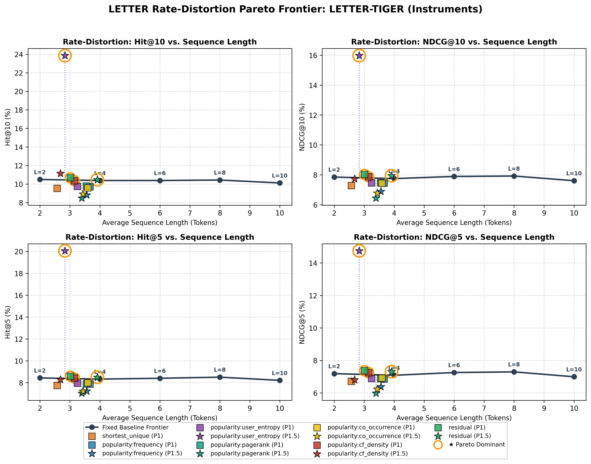
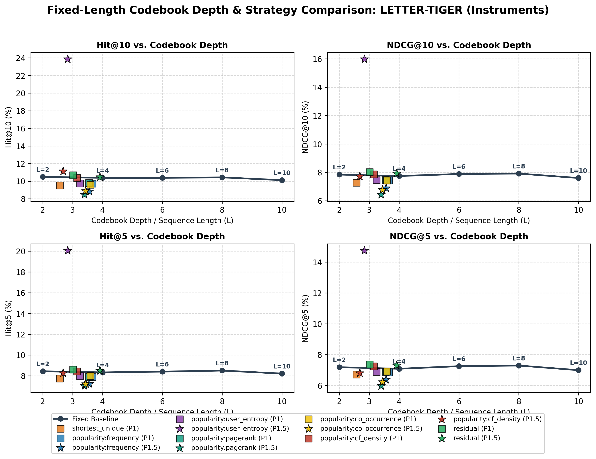

# Vanilla RQ-VAE Strategy Comparison Report: LETTER-TIGER (Instruments)

- **Dataset**: `Instruments`
- **Model**: `LETTER-TIGER`
- **Tokenizer**: `rqvae`
- **Training Phase**: `Phase 1 & Phase 1.5 (All)`
- **Catalog Items**: 9,922
- **Total Interactions**: 206,153
- **Fixed ID Depth**: 4 tokens
- **Minimum Allowable Depth**: 1 token

### 1. Recommendation Performance

| Strategy | Phase | Mean Length | Weighted Length | Collisions | Hit@1 | Hit@5 | Hit@10 | NDCG@5 | NDCG@10 | Status |
| :--- | :---: | :---: | :---: | :---: | :---: | :---: | :---: | :---: | :---: | :---: |
| **fixed_L2** | - | 2.00 | 2.00 | 1195 | 5.93% | 8.44% | 10.49% | 7.19% | 7.85% | completed |
| **fixed** | - | 4.00 | 4.00 | 25 | 5.85% | 8.33% | 10.38% | 7.09% | 7.75% | completed |
| **fixed_L6** | - | 6.00 | 6.00 | 25 | 6.06% | 8.40% | 10.38% | 7.25% | 7.89% | completed |
| **fixed_L8** | - | 8.00 | 8.00 | 25 | 6.08% | 8.51% | 10.43% | 7.29% | 7.92% | completed |
| **fixed_L10** | - | 10.00 | 10.00 | 25 | 5.78% | 8.21% | 10.12% | 6.99% | 7.60% | completed |
| **shortest_unique** | 1 | 2.57 | 2.72 | 25 | 5.66% | 7.74% | 9.53% | 6.71% | 7.28% | completed |
| **popularity:frequency** | 1 | 3.66 | 3.20 | 25 | 5.78% | 7.88% | 9.72% | 6.85% | 7.44% | completed |
| **popularity:frequency** | 1.5 | 3.56 | 2.50 | 200 | 5.48% | 7.24% | 8.83% | 6.38% | 6.89% | completed |
| **popularity:user_entropy** | 1 | 3.24 | 2.93 | 25 | 5.78% | 7.96% | 9.75% | 6.88% | 7.46% | completed |
| **popularity:user_entropy** | 1.5 | 2.83 | 1.73 | 1412 | 8.91% | 20.06% | 23.85% | 14.75% | 15.97% | completed |
| **popularity:pagerank** | 1 | 3.55 | 3.11 | 25 | 5.81% | 7.90% | 9.78% | 6.87% | 7.47% | completed |
| **popularity:pagerank** | 1.5 | 3.39 | 2.31 | 275 | 4.83% | 7.03% | 8.49% | 5.98% | 6.44% | completed |
| **popularity:co_occurrence** | 1 | 3.59 | 3.16 | 25 | 5.83% | 7.98% | 9.59% | 6.92% | 7.43% | completed |
| **popularity:co_occurrence** | 1.5 | 3.44 | 2.32 | 348 | 5.18% | 7.22% | 8.90% | 6.23% | 6.77% | completed |
| **popularity:cf_density** | 1 | 3.15 | 3.14 | 25 | 6.02% | 8.43% | 10.36% | 7.24% | 7.86% | completed |
| **popularity:cf_density** | 1.5 | 2.68 | 2.45 | 1899 | 5.36% | 8.27% | 11.14% | 6.81% | 7.73% | completed |
| **residual** | 1 | 3.01 | 3.99 | 25 | 6.12% | 8.60% | 10.67% | 7.36% | 8.03% | completed |
| **residual** | 1.5 | 3.91 | 3.90 | 242 | 6.08% | 8.49% | 10.46% | 7.31% | 7.94% | completed |

### 2. Semantic ID Evaluation & Compression

| Strategy | Phase | Catalog Mean | Traffic W-Len | Token Savings | L=1 | L=2 | L=3 | L=4 | Collisions | Spearman ρ |
| :--- | :---: | :---: | :---: | :---: | :---: | :---: | :---: | :---: | :---: | :---: |
| **fixed_L2** | - | 2.000 | 2.000 | 50.0% | 0.0% | 100.0% | 0.0% | 0.0% | 1195 | - |
| **fixed** | - | 4.000 | 4.000 | 0.0% | 0.0% | 0.0% | 0.0% | 100.0% | 25 | - |
| **fixed_L6** | - | 6.000 | 6.000 | -50.0% | 0.0% | 0.0% | 0.0% | 0.0% | 25 | - |
| **fixed_L8** | - | 8.000 | 8.000 | -100.0% | 0.0% | 0.0% | 0.0% | 0.0% | 25 | - |
| **fixed_L10** | - | 10.000 | 10.000 | -150.0% | 0.0% | 0.0% | 0.0% | 0.0% | 25 | - |
| **shortest_unique** | 1 | 2.572 | 2.724 | 31.9% | 0.2% | 48.1% | 46.1% | 5.6% | 25 | - |
| **popularity:frequency** | 1 | 3.663 | 3.197 | 20.1% | 0.0% | 3.5% | 26.6% | 69.9% | 25 | 1.0000 |
| **popularity:frequency** | 1.5 | 3.558 | 2.499 | 37.5% | 1.7% | 8.1% | 23.1% | 67.2% | 200 | -0.7211 |
| **popularity:user_entropy** | 1 | 3.244 | 2.933 | 26.7% | 0.0% | 15.5% | 44.7% | 39.8% | 25 | 1.0000 |
| **popularity:user_entropy** | 1.5 | 2.834 | 1.734 | 56.6% | 15.3% | 21.5% | 27.6% | 35.6% | 1412 | -0.9171 |
| **popularity:pagerank** | 1 | 3.547 | 3.113 | 22.2% | 0.0% | 5.6% | 34.0% | 60.3% | 25 | 0.9319 |
| **popularity:pagerank** | 1.5 | 3.395 | 2.308 | 42.3% | 2.9% | 11.8% | 28.4% | 57.0% | 275 | -0.8264 |
| **popularity:co_occurrence** | 1 | 3.593 | 3.156 | 21.1% | 0.0% | 5.8% | 29.1% | 65.1% | 25 | 0.8315 |
| **popularity:co_occurrence** | 1.5 | 3.436 | 2.324 | 41.9% | 4.0% | 10.8% | 22.8% | 62.4% | 348 | -0.8262 |
| **popularity:cf_density** | 1 | 3.149 | 3.144 | 21.4% | 0.0% | 20.5% | 44.1% | 35.4% | 25 | 0.4135 |
| **popularity:cf_density** | 1.5 | 2.681 | 2.451 | 38.7% | 20.4% | 22.8% | 25.1% | 31.7% | 1899 | -0.9347 |
| **residual** | 1 | 3.013 | 3.995 | 0.1% | 0.0% | 5.9% | 86.8% | 7.3% | 25 | - |
| **residual** | 1.5 | 3.912 | 3.899 | 2.5% | 0.1% | 0.8% | 6.7% | 92.3% | 242 | - |

### 3. Rate-Distortion & Pareto Frontier Analysis

> Benchmarking variable-length token efficiency against fixed-length baselines of equivalent token budgets.
> - **Floor Baseline ($L_{\text{floor}}$)**: Highest evaluated fixed depth $\le$ Mean Length.
> - **Ceiling Baseline ($L_{\text{ceil}}$)**: Lowest evaluated fixed depth $\ge$ Mean Length.
> - **Interpolated ($L_{\text{interp}}$)**: Expected fixed metric at matched average token length: $M_{\text{interp}} = (1-\alpha) M_{\text{floor}} + \alpha M_{\text{ceil}}$.
> - **Pareto Classification**:
>   - **★ Dominant**: Variable model achieves equal or higher recommendation quality using strictly fewer tokens than $L_{\text{ceil}}$ ($M \ge M_{\text{ceil}}$ with $\bar{L} \le L_{\text{ceil}}$).
>   - **▲ Efficient**: Variable model outperforms the interpolated fixed baseline at matched token budget ($\Delta_{\text{interp}} > 0$).
>   - **≈ Parity**: Within 2% of matched-budget baseline.
>   - **▼ Trade-off**: Standard compression trade-off.

#### Codebook Depth & Strategy Comparison

#### Reference Fixed-Length Rate-Distortion Curve

| Depth (L) | Mean Length | Hit@1 | Hit@5 | Hit@10 | NDCG@5 | NDCG@10 | Token Savings |
| :---: | :---: | :---: | :---: | :---: | :---: | :---: | :---: |
| **L=2** | 2.00 | 5.93% | 8.44% | 10.49% | 7.19% | 7.85% | 50.0% |
| **L=4** | 4.00 | 5.85% | 8.33% | 10.38% | 7.09% | 7.75% | 0.0% |
| **L=6** | 6.00 | 6.06% | 8.40% | 10.38% | 7.25% | 7.89% | -50.0% |
| **L=8** | 8.00 | 6.08% | 8.51% | 10.43% | 7.29% | 7.92% | -100.0% |
| **L=10** | 10.00 | 5.78% | 8.21% | 10.12% | 6.99% | 7.60% | -150.0% |

#### Variable-Length Rate-Distortion Frontier & Pareto Evaluation

| Strategy | Phase | Mean Length | Token Savings | Hit@10 | NDCG@10 | Floor L | Ceil L | Interp NDCG@10 | Δ vs Interp | Δ vs L_max | Pareto Status |
| :--- | :---: | :---: | :---: | :---: | :---: | :---: | :---: | :---: | :---: | :---: | :---: |
| **shortest_unique** | 1 | 2.57 | 31.9% | 9.53% | 7.28% | L=2 | L=4 | 7.82% | **-6.9%** | -6.0% | ▼ Trade-off |
| **popularity:frequency** | 1 | 3.66 | 20.1% | 9.72% | 7.44% | L=2 | L=4 | 7.76% | **-4.1%** | -3.9% | ▼ Trade-off |
| **popularity:frequency** | 1.5 | 3.56 | 37.5% | 8.83% | 6.89% | L=2 | L=4 | 7.77% | **-11.3%** | -11.1% | ▼ Trade-off |
| **popularity:user_entropy** | 1 | 3.24 | 26.7% | 9.75% | 7.46% | L=2 | L=4 | 7.78% | **-4.2%** | -3.7% | ▼ Trade-off |
| **popularity:user_entropy** | 1.5 | 2.83 | 56.6% | 23.85% | 15.97% | L=2 | L=4 | 7.80% | **+104.7%** | +106.2% | ★ Dominant |
| **popularity:pagerank** | 1 | 3.55 | 22.2% | 9.78% | 7.47% | L=2 | L=4 | 7.77% | **-3.8%** | -3.5% | ▼ Trade-off |
| **popularity:pagerank** | 1.5 | 3.39 | 42.3% | 8.49% | 6.44% | L=2 | L=4 | 7.78% | **-17.2%** | -16.8% | ▼ Trade-off |
| **popularity:co_occurrence** | 1 | 3.59 | 21.1% | 9.59% | 7.43% | L=2 | L=4 | 7.77% | **-4.3%** | -4.0% | ▼ Trade-off |
| **popularity:co_occurrence** | 1.5 | 3.44 | 41.9% | 8.90% | 6.77% | L=2 | L=4 | 7.77% | **-12.9%** | -12.6% | ▼ Trade-off |
| **popularity:cf_density** | 1 | 3.15 | 21.4% | 10.36% | 7.86% | L=2 | L=4 | 7.79% | **+1.0%** | +1.5% | ★ Dominant |
| **popularity:cf_density** | 1.5 | 2.68 | 38.7% | 11.14% | 7.73% | L=2 | L=4 | 7.81% | **-1.1%** | -0.2% | ≈ Parity |
| **residual** | 1 | 3.01 | 0.1% | 10.67% | 8.03% | L=2 | L=4 | 7.80% | **+2.9%** | +3.6% | ★ Dominant |
| **residual** | 1.5 | 3.91 | 2.5% | 10.46% | 7.94% | L=2 | L=4 | 7.75% | **+2.4%** | +2.5% | ★ Dominant |

### 4. Phase 1 vs. Phase 1.5 Head-to-Head Comparison

> Direct comparison of Post-Hoc Truncation (Phase 1) vs. Length-Aware Training (Phase 1.5). Positive Δ indicates improvement from length-aware training. SID Agreement and Mean |ΔL| indicate whether semantic IDs changed or remained identical across phases.

| Strategy | P1 Mean Length | P1.5 Mean Length | Mean \|ΔL\| | SID Agreement | P1 Hit@10 | P1.5 Hit@10 | Δ Hit@10 | P1 NDCG@10 | P1.5 NDCG@10 | Δ NDCG@10 |
| :--- | :---: | :---: | :---: | :---: | :---: | :---: | :---: | :---: | :---: | :---: |
| **popularity:frequency** | 3.66 | 3.56 | 0.105 | 0.00% | 9.72% | 8.83% | **-0.89%** | 7.44% | 6.89% | **-0.56%** |
| **popularity:user_entropy** | 3.24 | 2.83 | 0.409 | 0.00% | 9.75% | 23.85% | **+14.10%** | 7.46% | 15.97% | **+8.52%** |
| **popularity:pagerank** | 3.55 | 3.39 | 0.153 | 0.00% | 9.78% | 8.49% | **-1.30%** | 7.47% | 6.44% | **-1.03%** |
| **popularity:co_occurrence** | 3.59 | 3.44 | 0.157 | 0.00% | 9.59% | 8.90% | **-0.69%** | 7.43% | 6.77% | **-0.66%** |
| **popularity:cf_density** | 3.15 | 2.68 | 0.468 | 0.01% | 10.36% | 11.14% | **+0.78%** | 7.86% | 7.73% | **-0.14%** |
| **residual** | 3.01 | 3.91 | 0.089 | 0.00% | 10.67% | 10.46% | **-0.21%** | 8.03% | 7.94% | **-0.09%** |

### 5. Pairwise Exact Semantic ID Agreement Rate (%)

> Percentage of items in catalog that receive an identical Semantic ID across strategies.

| Strategy | fixed_L2 | fixed | fixed_L6 | fixed_L8 | fixed_L10 | shortest_unique (P1) | popularity:frequency (P1) | popularity:frequency (P1.5) | popularity:user_entropy (P1) | popularity:user_entropy (P1.5) | popularity:pagerank (P1) | popularity:pagerank (P1.5) | popularity:co_occurrence (P1) | popularity:co_occurrence (P1.5) | popularity:cf_density (P1) | popularity:cf_density (P1.5) | residual (P1) | residual (P1.5) |
| :--- | :---: | :---: | :---: | :---: | :---: | :---: | :---: | :---: | :---: | :---: | :---: | :---: | :---: | :---: | :---: | :---: | :---: | :---: |
| **fixed_L2** | 100.00% | 0.00% | 0.00% | 0.00% | 0.00% | 0.00% | 0.00% | 0.00% | 0.00% | 0.00% | 0.00% | 0.00% | 0.00% | 0.00% | 0.00% | 0.00% | 0.00% | 0.00% |
| **fixed** | 0.00% | 100.00% | 0.00% | 0.00% | 0.00% | 5.64% | 69.85% | 0.00% | 39.81% | 0.00% | 60.34% | 0.00% | 65.08% | 0.00% | 35.44% | 0.00% | 0.00% | 0.00% |
| **fixed_L6** | 0.00% | 0.00% | 100.00% | 0.00% | 0.00% | 0.00% | 0.00% | 0.00% | 0.00% | 0.00% | 0.00% | 0.00% | 0.00% | 0.00% | 0.00% | 0.00% | 0.00% | 0.00% |
| **fixed_L8** | 0.00% | 0.00% | 0.00% | 100.00% | 0.00% | 0.00% | 0.00% | 0.00% | 0.00% | 0.00% | 0.00% | 0.00% | 0.00% | 0.00% | 0.00% | 0.00% | 0.00% | 0.00% |
| **fixed_L10** | 0.00% | 0.00% | 0.00% | 0.00% | 100.00% | 0.00% | 0.00% | 0.00% | 0.00% | 0.00% | 0.00% | 0.00% | 0.00% | 0.00% | 0.00% | 0.00% | 0.00% | 0.00% |
| **shortest_unique (P1)** | 0.00% | 5.64% | 0.00% | 0.00% | 0.00% | 100.00% | 25.77% | 0.00% | 51.91% | 0.00% | 32.56% | 0.00% | 30.15% | 0.00% | 57.68% | 0.01% | 0.00% | 0.00% |
| **popularity:frequency (P1)** | 0.00% | 69.85% | 0.00% | 0.00% | 0.00% | 25.77% | 100.00% | 0.00% | 59.94% | 0.00% | 87.38% | 0.00% | 85.93% | 0.00% | 48.36% | 0.00% | 0.00% | 0.00% |
| **popularity:frequency (P1.5)** | 0.00% | 0.00% | 0.00% | 0.00% | 0.00% | 0.00% | 0.00% | 100.00% | 0.00% | 0.00% | 0.00% | 0.00% | 0.00% | 0.02% | 0.00% | 0.00% | 0.00% | 0.00% |
| **popularity:user_entropy (P1)** | 0.00% | 39.81% | 0.00% | 0.00% | 0.00% | 51.91% | 59.94% | 0.00% | 100.00% | 0.00% | 69.98% | 0.00% | 63.82% | 0.00% | 58.42% | 0.01% | 0.00% | 0.00% |
| **popularity:user_entropy (P1.5)** | 0.00% | 0.00% | 0.00% | 0.00% | 0.00% | 0.00% | 0.00% | 0.00% | 0.00% | 100.00% | 0.00% | 0.00% | 0.00% | 0.01% | 0.00% | 0.09% | 0.00% | 0.00% |
| **popularity:pagerank (P1)** | 0.00% | 60.34% | 0.00% | 0.00% | 0.00% | 32.56% | 87.38% | 0.00% | 69.98% | 0.00% | 100.00% | 0.00% | 83.11% | 0.00% | 50.50% | 0.00% | 0.00% | 0.00% |
| **popularity:pagerank (P1.5)** | 0.00% | 0.00% | 0.00% | 0.00% | 0.00% | 0.00% | 0.00% | 0.00% | 0.00% | 0.00% | 0.00% | 100.00% | 0.00% | 0.01% | 0.00% | 0.00% | 0.00% | 0.00% |
| **popularity:co_occurrence (P1)** | 0.00% | 65.08% | 0.00% | 0.00% | 0.00% | 30.15% | 85.93% | 0.00% | 63.82% | 0.00% | 83.11% | 0.00% | 100.00% | 0.00% | 51.31% | 0.00% | 0.00% | 0.00% |
| **popularity:co_occurrence (P1.5)** | 0.00% | 0.00% | 0.00% | 0.00% | 0.00% | 0.00% | 0.00% | 0.02% | 0.00% | 0.01% | 0.00% | 0.01% | 0.00% | 100.00% | 0.00% | 0.01% | 0.00% | 0.00% |
| **popularity:cf_density (P1)** | 0.00% | 35.44% | 0.00% | 0.00% | 0.00% | 57.68% | 48.36% | 0.00% | 58.42% | 0.00% | 50.50% | 0.00% | 51.31% | 0.00% | 100.00% | 0.01% | 0.00% | 0.00% |
| **popularity:cf_density (P1.5)** | 0.00% | 0.00% | 0.00% | 0.00% | 0.00% | 0.01% | 0.00% | 0.00% | 0.01% | 0.09% | 0.00% | 0.00% | 0.00% | 0.01% | 0.01% | 100.00% | 0.00% | 0.00% |
| **residual (P1)** | 0.00% | 0.00% | 0.00% | 0.00% | 0.00% | 0.00% | 0.00% | 0.00% | 0.00% | 0.00% | 0.00% | 0.00% | 0.00% | 0.00% | 0.00% | 0.00% | 100.00% | 0.00% |
| **residual (P1.5)** | 0.00% | 0.00% | 0.00% | 0.00% | 0.00% | 0.00% | 0.00% | 0.00% | 0.00% | 0.00% | 0.00% | 0.00% | 0.00% | 0.00% | 0.00% | 0.00% | 0.00% | 100.00% |

### 6. Pairwise Mean Absolute Length Difference (Tokens)

> Average token length divergence per item (|L_A - L_B|). Lower value indicates closer length profiles.

| Strategy | fixed_L2 | fixed | fixed_L6 | fixed_L8 | fixed_L10 | shortest_unique (P1) | popularity:frequency (P1) | popularity:frequency (P1.5) | popularity:user_entropy (P1) | popularity:user_entropy (P1.5) | popularity:pagerank (P1) | popularity:pagerank (P1.5) | popularity:co_occurrence (P1) | popularity:co_occurrence (P1.5) | popularity:cf_density (P1) | popularity:cf_density (P1.5) | residual (P1) | residual (P1.5) |
| :--- | :---: | :---: | :---: | :---: | :---: | :---: | :---: | :---: | :---: | :---: | :---: | :---: | :---: | :---: | :---: | :---: | :---: | :---: |
| **fixed_L2** | 0.000 | 2.000 | 4.000 | 6.000 | 8.000 | 0.576 | 1.663 | 1.592 | 1.244 | 1.141 | 1.547 | 1.452 | 1.593 | 1.516 | 1.150 | 1.088 | 1.996 | 1.915 |
| **fixed** | 2.000 | 0.000 | 2.000 | 4.000 | 6.000 | 1.428 | 0.337 | 0.442 | 0.756 | 1.166 | 0.453 | 0.605 | 0.407 | 0.564 | 0.851 | 1.319 | 0.004 | 0.088 |
| **fixed_L6** | 4.000 | 2.000 | 0.000 | 2.000 | 4.000 | 3.428 | 2.337 | 2.442 | 2.756 | 3.166 | 2.453 | 2.605 | 2.407 | 2.564 | 2.851 | 3.319 | 2.004 | 2.088 |
| **fixed_L8** | 6.000 | 4.000 | 2.000 | 0.000 | 2.000 | 5.428 | 4.337 | 4.442 | 4.756 | 5.166 | 4.453 | 4.605 | 4.407 | 4.564 | 4.851 | 5.319 | 4.004 | 4.088 |
| **fixed_L10** | 8.000 | 6.000 | 4.000 | 2.000 | 0.000 | 7.428 | 6.337 | 6.442 | 6.756 | 7.166 | 6.453 | 6.605 | 6.407 | 6.564 | 6.851 | 7.319 | 6.004 | 6.088 |
| **shortest_unique (P1)** | 0.576 | 1.428 | 3.428 | 5.428 | 7.428 | 0.000 | 1.091 | 1.196 | 0.671 | 1.081 | 0.975 | 1.127 | 1.020 | 1.177 | 0.577 | 1.045 | 1.427 | 1.390 |
| **popularity:frequency (P1)** | 1.663 | 0.337 | 2.337 | 4.337 | 6.337 | 1.091 | 0.000 | 0.105 | 0.419 | 0.829 | 0.126 | 0.279 | 0.143 | 0.299 | 0.633 | 1.100 | 0.340 | 0.384 |
| **popularity:frequency (P1.5)** | 1.592 | 0.442 | 2.442 | 4.442 | 6.442 | 1.196 | 0.105 | 0.000 | 0.524 | 0.724 | 0.231 | 0.174 | 0.248 | 0.204 | 0.738 | 1.070 | 0.443 | 0.470 |
| **popularity:user_entropy (P1)** | 1.244 | 0.756 | 2.756 | 4.756 | 6.756 | 0.671 | 0.419 | 0.524 | 0.000 | 0.409 | 0.306 | 0.458 | 0.391 | 0.547 | 0.488 | 0.956 | 0.758 | 0.763 |
| **popularity:user_entropy (P1.5)** | 1.141 | 1.166 | 3.166 | 5.166 | 7.166 | 1.081 | 0.829 | 0.724 | 0.409 | 0.000 | 0.715 | 0.563 | 0.800 | 0.648 | 0.898 | 0.863 | 1.164 | 1.140 |
| **popularity:pagerank (P1)** | 1.547 | 0.453 | 2.453 | 4.453 | 6.453 | 0.975 | 0.126 | 0.231 | 0.306 | 0.715 | 0.000 | 0.153 | 0.170 | 0.327 | 0.594 | 1.062 | 0.455 | 0.487 |
| **popularity:pagerank (P1.5)** | 1.452 | 0.605 | 2.605 | 4.605 | 6.605 | 1.127 | 0.279 | 0.174 | 0.458 | 0.563 | 0.153 | 0.000 | 0.323 | 0.222 | 0.747 | 1.021 | 0.605 | 0.617 |
| **popularity:co_occurrence (P1)** | 1.593 | 0.407 | 2.407 | 4.407 | 6.407 | 1.020 | 0.143 | 0.248 | 0.391 | 0.800 | 0.170 | 0.323 | 0.000 | 0.157 | 0.594 | 1.062 | 0.410 | 0.450 |
| **popularity:co_occurrence (P1.5)** | 1.516 | 0.564 | 2.564 | 4.564 | 6.564 | 1.177 | 0.299 | 0.204 | 0.547 | 0.648 | 0.327 | 0.222 | 0.157 | 0.000 | 0.751 | 1.018 | 0.565 | 0.587 |
| **popularity:cf_density (P1)** | 1.150 | 0.851 | 2.851 | 4.851 | 6.851 | 0.577 | 0.633 | 0.738 | 0.488 | 0.898 | 0.594 | 0.747 | 0.594 | 0.751 | 0.000 | 0.468 | 0.851 | 0.856 |
| **popularity:cf_density (P1.5)** | 1.088 | 1.319 | 3.319 | 5.319 | 7.319 | 1.045 | 1.100 | 1.070 | 0.956 | 0.863 | 1.062 | 1.021 | 1.062 | 1.018 | 0.468 | 0.000 | 1.317 | 1.296 |
| **residual (P1)** | 1.996 | 0.004 | 2.004 | 4.004 | 6.004 | 1.427 | 0.340 | 0.443 | 0.758 | 1.164 | 0.455 | 0.605 | 0.410 | 0.565 | 0.851 | 1.317 | 0.000 | 0.089 |
| **residual (P1.5)** | 1.915 | 0.088 | 2.088 | 4.088 | 6.088 | 1.390 | 0.384 | 0.470 | 0.763 | 1.140 | 0.487 | 0.617 | 0.450 | 0.587 | 0.856 | 1.296 | 0.089 | 0.000 |
